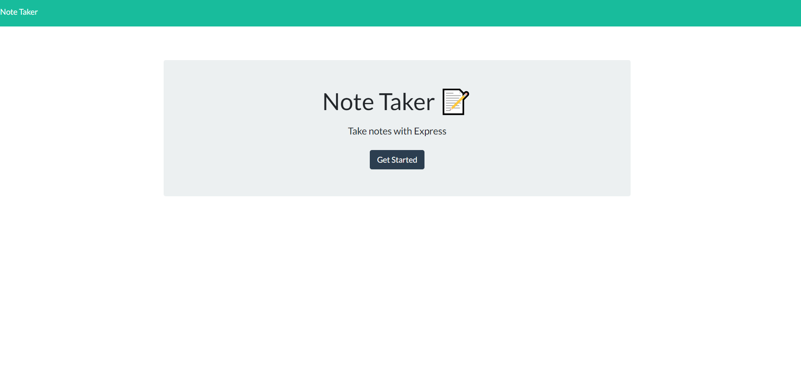
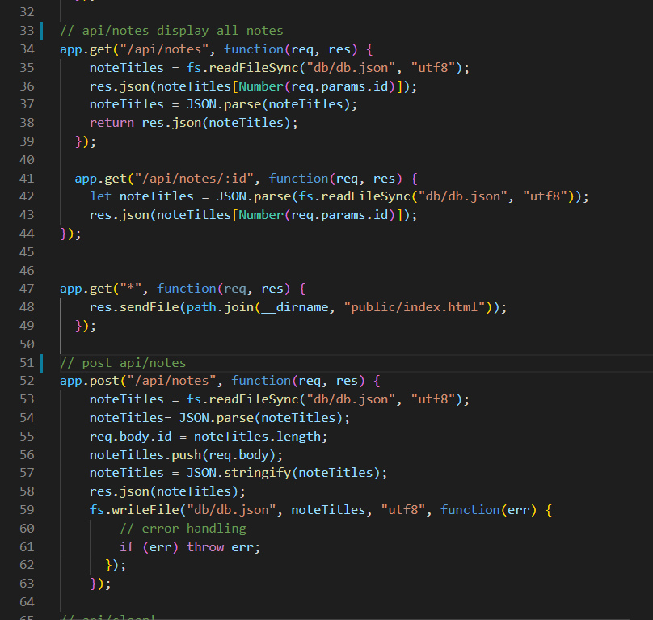
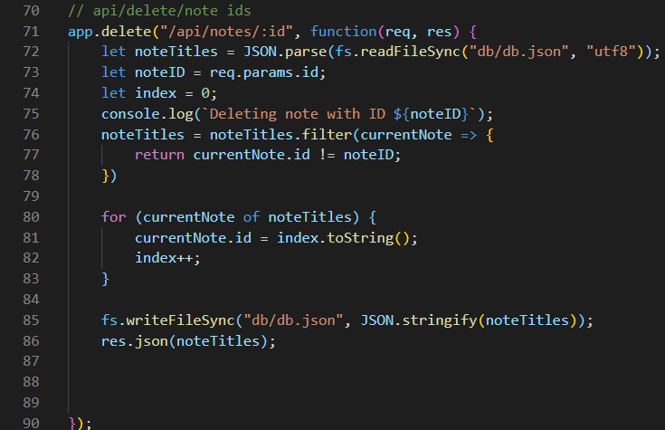

#  Note Taker

### A simple app that allows a user to take notes, save them and access them later.

## Table of Contents
* [Technologies Used](#Technologies_Used)
* [Deployed Site](#Deployed)
* [Features](#Features)
* [Usage](#Usage)
* [Author](#Author)
* [Credits](#Credits)
* [License](#License)

## Technologies_Used
* HTML (25.4%)
* CSS (11.2%)
* Javascript (63.4%) 
* [Bootstrap](https://getbootstrap.com/)
* [jQuery](https://api.jquery.com/)
* [heroku](https://signup.heroku.com/t/platform?c=70130000001xDpdAAE&gclid=CjwKCAjwiaX8BRBZEiwAQQxGx43Sk7_WDBlD1FE8hcLW9IYhNyk33BaDmv4eMRzr_7uxK5IpQvnONxoC5vAQAvD_BwE)
* [node.js](https://www.npmjs.com/)
* [express.js](https://expressjs.com/)

## Deployed Site
[Note-Taker](https://warm-caverns-86071.herokuapp.com/)

## Features 

### __1. A domain at heroku__

In order to have a wesbite that shows server side api, I had to turn to herku domain hosting. The benefit of heroku is that it's free and it's auto generated names are really fun. The downside is that you have to the name heroku in your website. 

### __2. The ability to save notes__

What is the point of making a note if you can't save it? First, we use the app.get function to pull the data and then we use app.post to put into both the db.json and the container to the right

 
### __3. The ability to delete notes__

Notes are meant to be temporary, although we do want to save them for a short time, we don't keep them forever thus the app.delete.

My app.delete starts about setting and parson the db.json( our notes databas) to a variable named noteTitles. I then set a second variable named noteID that requests the parameter id-this plucks the id of the note that was selected for the trash can. I also set an index equal to zero-the index will be used later in the for loop that sets all of the note id's to strings.  On linr 76 I yet again set noteTitles( my parsed db.json file) to filter out all notes that weren't selected for deletion. 

I then ran a for loop, athat looks for the notes of the array and strings them back into the string. 
### __4. A front page__

On first glance, the note taker having a front page seemed unnecesary to me-but then I realized, some people want private notes. Also, having an addition page allows for the app to be more easily incorporated into a website because the page on the front won't really mess with the functionality. 

### __5. Other__

 __For later builds__

_Incorporate as a peice of a workplace managerment website_

A good note take app is cool and all, but what about a website that helps you entirely manage your work day (sure there is google and outlook) but those sites almost have too much going and can be hard to learn how to use. Having something simpler would be easier for the less tech-savy worker. 

_Be able to manage notes by date/time taken_

I don't take notes in a vaccum and neither do most people. Usually notes correspond with a particular event, meeting or pontification session. I would like to track these events, for whatever purpose. 

_Minor Design changes_

I love a beautifully simple design, that doesn't add clutter to thoughts or ideas. However, when I started building this project- I could not figure out what the deal with the pen was- I still am not sure. So I would change to pen to be a word or something to make it easier to navigate.

  
## Usage
### This is meant for anyone who wants to use a website to take notes instead of carrying around a pen and notebook. 

## Author 
Rachael Kelm-Southworth

* [linkedin] (https://www.linkedin.com/in/rachael-kelm-southworth-87a3831b3) 

* [github] (https://github.com/RKSouth/)

 ## Credits

I would like to thank Kerwin, Manuel, Roger, Jerome and all my classmates for helping me understand this subject matter and anyone that contributed to make the base code.

## License
[MIT](https://choosealicense.com/licenses/mit/)

